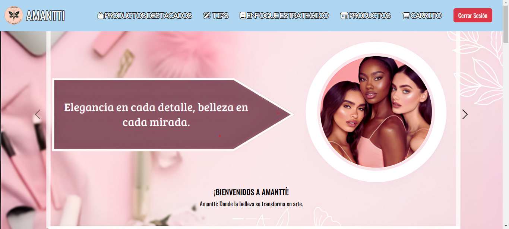

# Amantti · E-commerce de maquillaje en PHP y MySQL

Tienda virtual de maquillaje con catálogo para clientes y un **panel administrativo** para gestionar productos, categorías, proveedores, usuarios y estados. Es un proyecto académico del **SENA (Tecnólogo ADSI)** desarrollado en equipo; participé en el modelado de la base de datos relacional, la arquitectura de la información y el diseño de la interfaz.


[](LICENSE)



🎬 **Video de demostración:** [Video-Resultado-Final.mp4](Proyect-Amantti/Videos/Video-Resultado-Final.mp4)
> Al ser una aplicación PHP con base de datos, no se puede publicar en GitHub Pages; se ejecuta en local con XAMPP (ver instalación).

---

## 🎯 Problema que resuelve

Una tienda pequeña de maquillaje necesita vender en línea y, al mismo tiempo, administrar su inventario sin depender de hojas de cálculo. Amantti centraliza en una sola aplicación el catálogo público, el registro de clientes y la gestión interna del negocio.

## ✨ Características

**Para clientes**
- Catálogo de productos con imágenes, precios y filtrado por categorías.
- Registro e inicio de sesión de usuarios.
- Carrito de compras.

**Para administradores**
- Panel con CRUD de **productos** (incluida la carga de imágenes), **categorías**, **proveedores** y **usuarios**.
- Gestión de **roles** (administrador / cliente) y **estados** (activo / inactivo).
- Vistas de facturas y detalle de facturas.

## 🛠️ Stack tecnológico

| Capa | Tecnologías |
|---|---|
| Frontend | HTML5, CSS3, Bootstrap, JavaScript, SweetAlert2 |
| Backend | PHP (mysqli) |
| Base de datos | MySQL / MariaDB, administrada con phpMyAdmin |
| Entorno local | XAMPP (Apache + MySQL) |

## 🗂️ Arquitectura del proyecto

```
amantti-ecommerce-php/
├── index.php                 # Redirige a la tienda (Views/Cliente/index.php)
├── amantti.sql               # Script de la base de datos con datos de ejemplo
└── Proyect-Amantti/
    ├── Views/
    │   ├── Cliente/          # Tienda: inicio, categorías, carrito
    │   ├── Administrador/    # Panel administrativo (listados CRUD)
    │   ├── login.php
    │   └── register.php
    ├── Formularios/          # Formularios de creación y edición
    ├── CRUD/                 # Operaciones de inserción y edición
    ├── Suministros/          # Conexión, login, registro, control de acceso
    ├── Css/  Img/  Videos/
```

**Modelo de datos (resumen):** `usuarios` → `roles`, `productos` → `categorias` y `proveedores`, `facturas` → `detalle_facturas`; la tabla `parametros` define los estados (activo/inactivo) usados por las demás tablas mediante llaves foráneas.

## 🚀 Instalación y uso local

1. Instala [XAMPP](https://www.apachefriends.org/) e inicia **Apache** y **MySQL**.
2. Clona el repositorio dentro de la carpeta `htdocs`:
   ```bash
   cd C:/xampp/htdocs
   git clone https://github.com/juan-roserodev/amantti-ecommerce-php.git
   ```
3. Abre **phpMyAdmin** (`http://localhost/phpmyadmin`), crea una base de datos llamada `amantti` e importa el archivo `amantti.sql`.
4. Si tu MySQL tiene otro usuario o contraseña, ajústalos en `Proyect-Amantti/Suministros/conexion.php`.
5. Abre `http://localhost/amantti-ecommerce-php/` en el navegador.

**Usuarios de prueba** (datos ficticios incluidos en `amantti.sql`):

| Rol | Correo | Contraseña |
|---|---|---|
| Administrador | `admin@amantti.com` | `Admin12345` |
| Cliente | `cliente@amantti.com` | `Cliente12345` |

## 🔒 Seguridad y buenas prácticas aplicadas

- **Consultas preparadas** (`prepare` / `bind_param`) en todas las operaciones que reciben datos del usuario, para prevenir inyección SQL.
- **Contraseñas cifradas** con `password_hash` y verificadas con `password_verify`; política de contraseña mínima (8 caracteres, mayúsculas, minúsculas y números).
- **Control de acceso:** las operaciones del panel exigen una sesión activa con rol de administrador (`Suministros/verificar_admin.php`).
- **Sesiones:** el identificador de sesión se regenera al iniciar sesión para evitar la fijación de sesión.
- **Carga de archivos:** solo se aceptan imágenes (`jpg`, `jpeg`, `png`, `webp`, `gif`).
- **Datos de ejemplo anonimizados:** el script SQL no contiene información personal real.

**Mejoras pendientes:** tokens CSRF en los formularios, escape de salida (`htmlspecialchars`) en todas las vistas, validación del tipo MIME real de las imágenes y configuración de la conexión mediante variables de entorno.

## 👥 Créditos

Proyecto académico desarrollado en equipo durante el programa **Tecnólogo en Análisis y Desarrollo de Sistemas de Información** del SENA. Las imágenes de productos pertenecen a sus respectivas marcas y se usan solo con fines educativos.

## 👤 Autor

**Juan David Rosero Reyes** · Desarrollador web junior

[](https://juan-roserodev.github.io/)
[](https://www.linkedin.com/in/david-reyes-dev)
[](mailto:juan.rosero21@hotmail.com)
